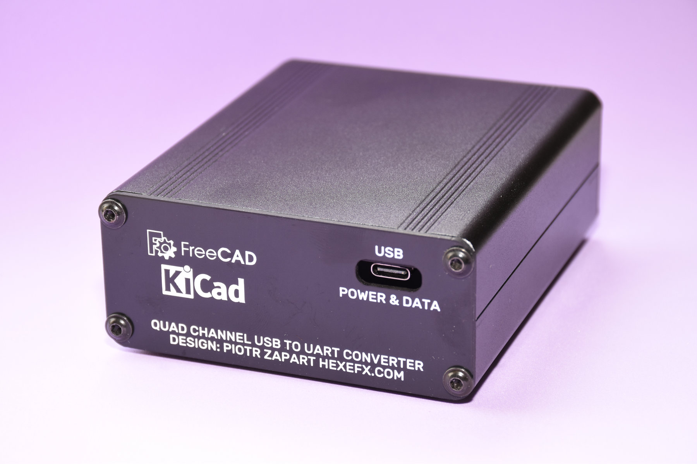
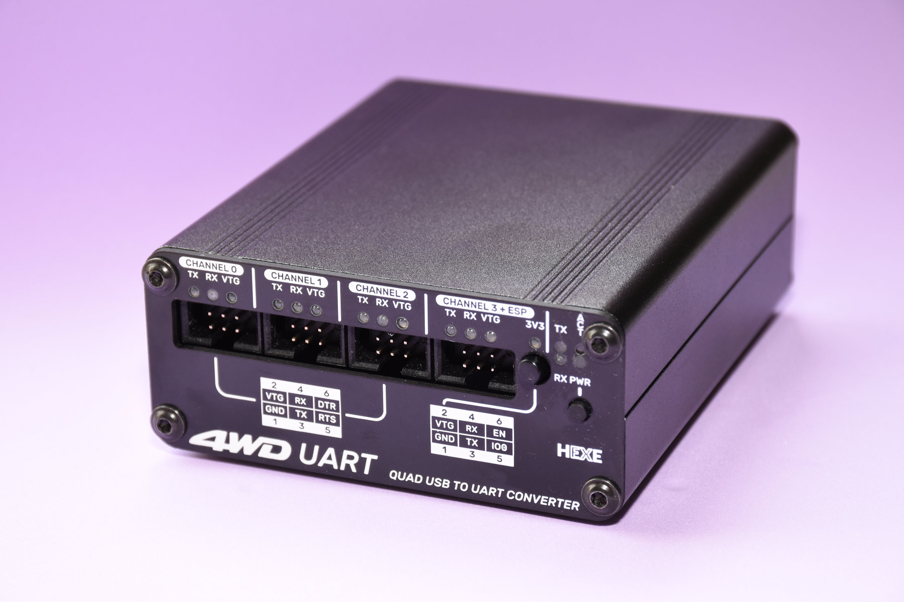
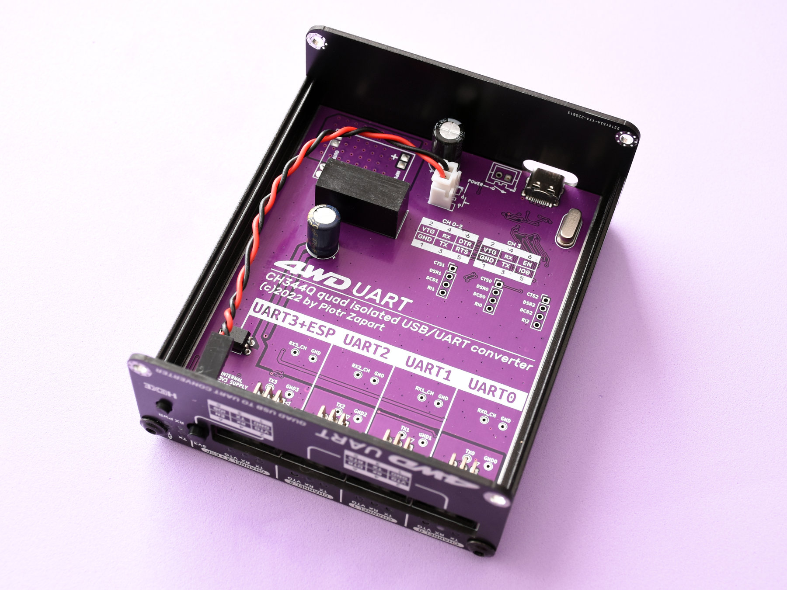
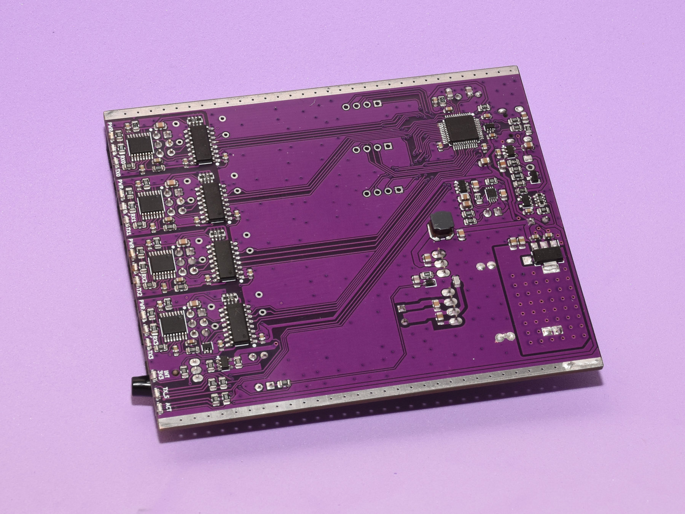

# 4WD UART
### CH344Q based quad isolated USB-UART interface with ESP programmer. 
![alt text][main_pic] 
### Features | Specs 
* 4 fully isolated channels  
  * Channel 0 - 2: classic UART with TX, RX, DTR and RTS signals
  * Channel 3: UART + ESP8266/ESP32 programmer signals (EN + IO0) and isolated 3.3V supply  
* individual TX/RX activity indicators per channel  
* theoretical max baud rate per channel: 6Mbps (tested up to 4.5Mbps on Linux)
* target voltage range: 3V - 5V (required for the isolators)
* USB C for power and data
* optional soft power switch (hold to power on/off) or regular toggle one
* USB inrush current limiter

<table>
  <tr>
    <td> </td>
    <td> </td>
  </tr>
  <tr>
    <td> </td>
    <td> </td>
  </tr>  
</table>  

### Leds  
Per channel:
* TX, RX - activity leds
* VTG - target power presence  

For channel 3:
* 3V3 - internal isolated 3.3V supply enable  

Global:
* TX, RX - global CH344Q activity leds
* ACT - USB enumeration success
* PWR - power indicator

### Electronic design  
![alt text][schematic] 
![alt text][pcb] 

### Mechanical design  
PCB is designed to slide into an 88x100x38mm aluminium extruded enclosure. Front panel and back panel PCBs replace the original plates.  
![alt text][mech1] 
![alt text][mech2] 

### Front panel  
Front panel is designed to accommodate the version with soft power switch. A normal pushbutton is used, but installed in reverse with terminals bent, as shown on the pic:  
![alt text][panel1]  
A single 1x02 0.1" SMD type pin header is used to connect the pushbutton to the main board.  
Light pipes for the leds can be made by pushing a tiny bit of hot glue into the holes.  

### Operation  
For most modern operating systems the device does not require any special drivers and should be detected automatically.  
On Linux 4WD UART is reporting as 4 /dev/TTYACMx devices:  
![alt text][linux]  

___
## All channels except 3 (if 3V3 is enabled) require external power supply in range from 3V to 5V to operate the output digital isolators and do the level shifting.  

___
Copyright (c) 2022 by Piotr Zapart  
www.hexefx.com  

## License
![alt text][cc-by-sa-image]  
This work is licensed under a [Creative Commons Attribution-ShareAlike 3.0 International License][cc-by-sa].  

[cc-by-sa]: http://creativecommons.org/licenses/by-sa/3.0/
[cc-by-sa-image]: https://licensebuttons.net/l/by-sa/3.0/88x31.png
[cc-by-sa-shield]: https://img.shields.io/badge/License-CC%20BY--SA%203.0-lightgrey.svg

[main_pic]: pics/4WD_UART_21.jpg "4WD UART front view"
[rear_view]: pics/4WD_UART_20.jpg "rear view"
[iso_view]: pics/4WD_UART_23.jpg "4WD UART"
[schematic]: MainBoard/4WD_UART_schm.png "4WD UART schematic"
[pcb]: pics/4WD_UART_pcb_kicad.jpg "4WD UART pcb"
[mech1]: pics/4wd_uart_freecad.jpg "4WD UART enclosure"
[mech2]: pics/enclosure.jpg "4WD UART enclosure"
[panel1]: pics/4WD_UART_25.jpg "4WD UART enclosure"  
[linux]: pics/ch344q_linux.jpg "4WD UART enclosure"
